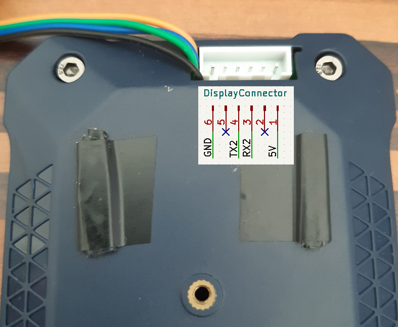

******************
Display Connection
******************

The display is connected to an USB-TTL that is capable of putting out 5V.

Display Connector
=================

Connection
==========

.. csv-table::
    :header-rows: 1

    Display Connector, USB-TTL
    5V, 5V
    GND, GND
    TX2, RXD
    RX2, TXD

.. note::
    On some of the USB-TTL RXD means RXD should be connected here, and some other
    it means that this pin is RXD. If the display just shows a static mask without
    any values: RXD and TXD needs to be swapped.