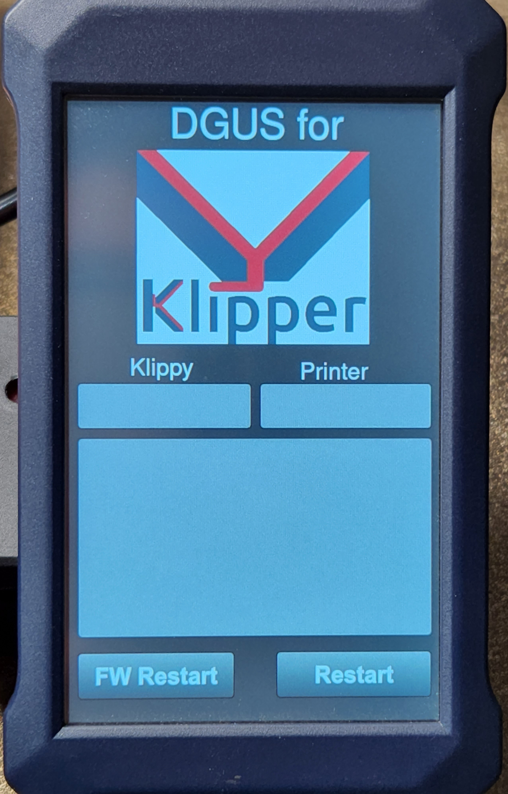

*******************************
Display show empty Startup Page
*******************************

If display just shows startup mask, without any other contents

this could be caused through different problems:

* Moonraker is not reachable (misconfigured printer ip)
* Serial Interface not connected properly (rx tx toggle)
* Wrong serial interface choosen.

Please read the following section and follow the instructions to get an idea what the actual problem is.

Check Moonraker Connection
==========================
You can see if the connection to Moonraker was established successfully in the default logging outputs 
of the *klipper_dgus* systemd service.

#) Restart *klipper_dgus* service

    .. code-block:: shell
        
        systemctl restart klipper_dgus

#) Wait arround 20 seconds 

#) To print out the logs of *klipper_dgus* service use the following command:

    .. code-block:: shell

        journalctl -u klipper_dgus

    .. hint::
        You can scroll up and down through the messages using the Up/Down Arrow on your keyboard.
        
        Leave the view by pressing *q*

You should see a message like this:

    .. code-block:: shell

        ...
        Oct 05 21:04:04 mainsailos python3[20714]: 2022-10-05 09:04:04 : INFO  : moonraker.websocket_interface : ws_on_open : Connection to Moonraker websocket established..
        ...

.. hint::
    For the most configurations setting the *ip* parameter should be set to 127.0.0.1 in :ref:`websocket.json <websocket_json>`
    Set this parameter only to the ip-address of the klipper hostmachine (Raspberry PI) if you haven't connected directly to klipper hostmachine.

Check if you used correct serial interface
==========================================
#) Disconnect the USB-TTL from the USB port.
#) show all serial interfaces

    .. code-block:: shell

        ls -la /dev/serial/by-id

    or 

    .. code-block:: shell

        ls -la /dev/serial/by-path

    or

    .. code-block:: shell
        
        ls -la /dev/ttyU*

#) Connect the USB-TTL

#) repeat command to list existing serial interfaces

#) a new entry should have been shown.

#) If not execute

    .. code-block:: shell

        dmesg

    and check kernel output messages when you connected the USB TTL the should be in the last few printed lines.

Serial interface not connected properly
=======================================
It could be that RX and TX must be switched. Unfortunately there a some USB-TTL where the RX/TX prins are labled correctly.

You can use following procedure to check if your RX/TX lines need be switched:

#) Enable logging for the serial data exchange.
    
    * open *logging.json* file (can be found in *dgus_display* folder using the web-ui)
    * locate the following section

    .. code-block:: json

        "dgus.display.communication.communication_interface": {
            "handlers": [
                "console1"
            ],
            "propagate": false,
            "level": "WARN"
        },

    * set *"level"* to *"INFO"*

    .. code-block:: json

        "dgus.display.communication.communication_interface": {
            "handlers": [
                "console1"
            ],
            "propagate": false,
            "level": "INFO"
        },

    * save the file

#) restart *klipper_dgus* service
        
    .. code-block:: shell

        systemctl restart klipper_dgus

#) view the log outputs

    .. code-block:: shell

        journalctl -u klipper_dgus

    
    When you could find entries in the log that contain *"Received response for..."* the your serial connected interface correct.

    .. code-block:: shell

        Oct 05 21:14:19 mainsailos python3[21068]: 2022-10-05 09:14:19 : INFO  : dgus.display.communication.communication_interface : _do_serial_communication : Sending Request 'DataVariable - Write Data - Address: 0x2030'
        Oct 05 21:14:19 mainsailos python3[21068]: 2022-10-05 09:14:19 : INFO  : dgus.display.communication.communication_interface : _do_serial_communication : Received response for 'DataVariable - Write Data - Address: 0x2030'

    If you you just see *"Sending Request .."* the you have to switch RX and TX pin. Then check the logs again.

#) Repeat step 1 but disable logging by setting by setting *level* back to *WARN*

#) restart *klipper_dgus* service
        
    .. code-block:: shell

        systemctl restart klipper_dgus

